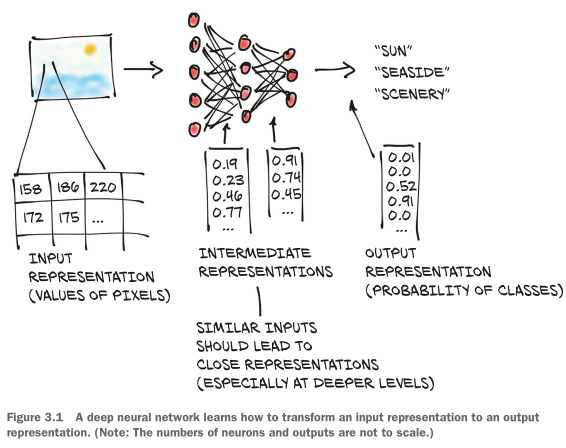
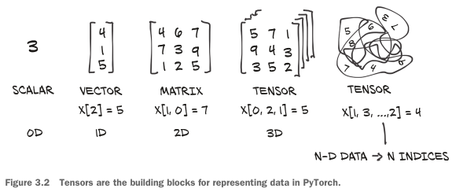
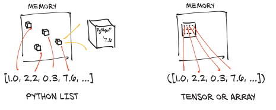
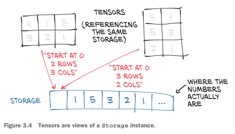
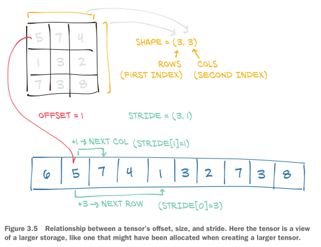
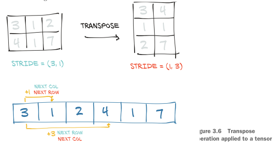
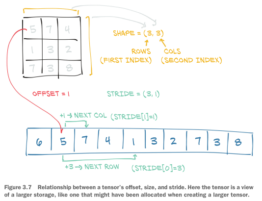
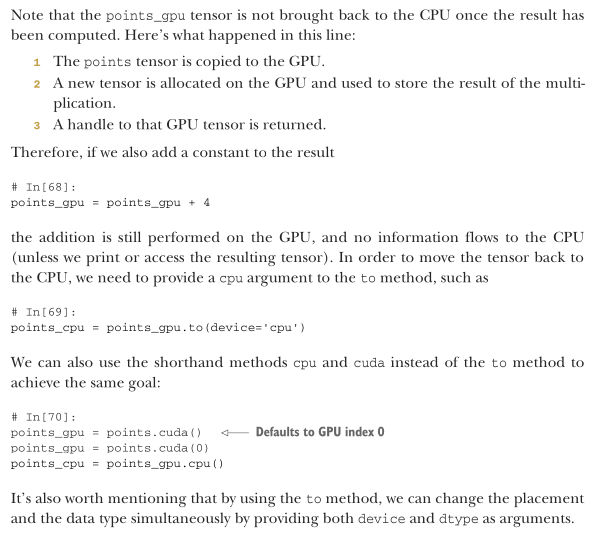

# Deep Learning with PyTorch

[Book repo with code examples](https://github.com/deep-learning-with-pytorch/dlwpt-code)

## Chapter 2: Pretrained networks

Para preprocesar imágenes se utilizarán los _arrays_ multidimensionales de _PyTorch_: `torch.Tensor`.
Concretamente, serán tensores de tres dimensiones. Una imagen posee su componente RGB y un ancho y un alto. Por lo tanto, el tensor representará, por un lado, la componente de color y las dos dimensiones espaciales de la imagen de un tamaño específico.

### AlexNet, ResNet

### GAN (Generative Adversal Networks)

Generador + discriminador

### CycleGAN

### NeuralTalk2

### _Torchvision_

Cargar modelos desde `torch.hub`
Importante `hubconf.py`

> [!NOTE]
> Todo esto estará relativamente desfasado

## Chapter 3: It starts with a tensor

### The essence of tensors

Las listas y tuplas de Python son colecciones de objetos que se almacenan de forma individual en memoria. Sin embargo, los tensores de PyTorch o los vectores de Numpy se almacenan como números (`float32`) dentro de un bloque contiguo de memoria. No son objetos de Python individuales. Esto es ideal para realizar cálculos vectorizados para GPU o CPU optimizada.

### Tensor element types

float32 by default

interesante float16 para GPU, pero no soportado en CPU

índices -> int64

### Scenic views of storage

### Tensor metadata: Size, offset, and stride

### Contiguous tensors

### Moving tensors to the GPU

Parte importante:

