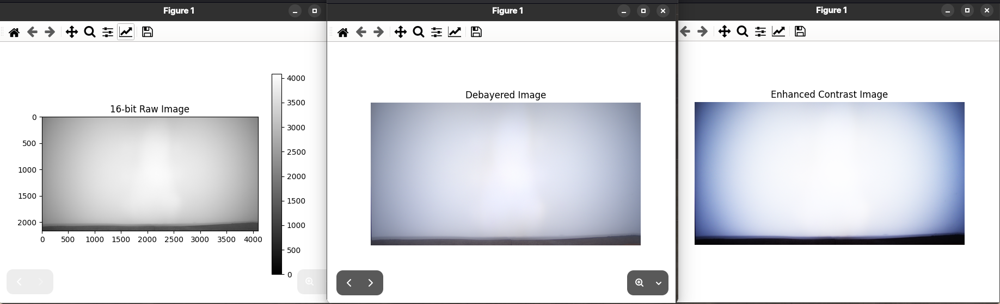

# 08/11/2025

-   Ejemplo: `exp_read_raw.py`:

    -   Añadido algo de tipado
    -   Incluida la mejora del contraste con sigmoide
    -   Probado

    

-   Main doc creada

# TODO

-   [ ] Implementar módulo `debayer` propio: [pytorch-debayer](https://github.com/cheind/pytorch-debayer)
-   [ ] Integrar lectura de imagen RAW en GUI
-   [ ] Integrar mejora del contraste de la sigmoide en GUI
-   [ ] Estructura aplicación:
    -   Módulos para aplicar transformaciones/mejoras
    -   GUI con `pyqt`
    -   Creación del `pipeline` de operaciones
